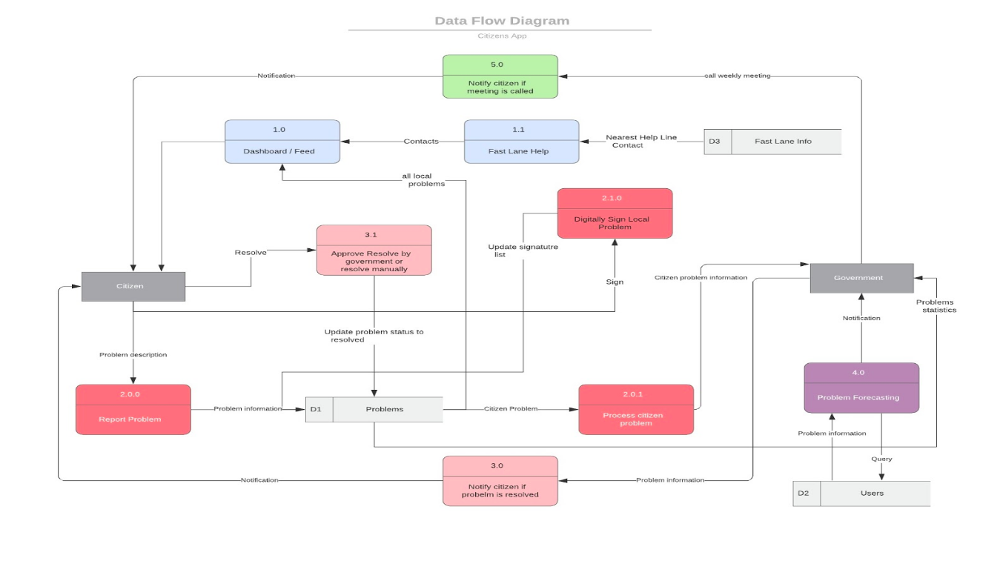
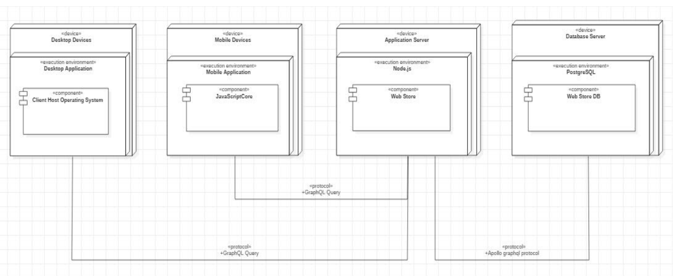
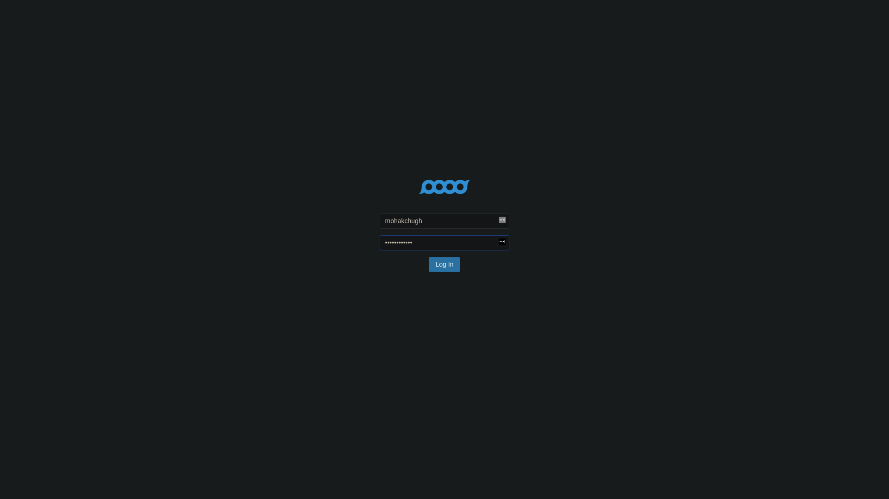
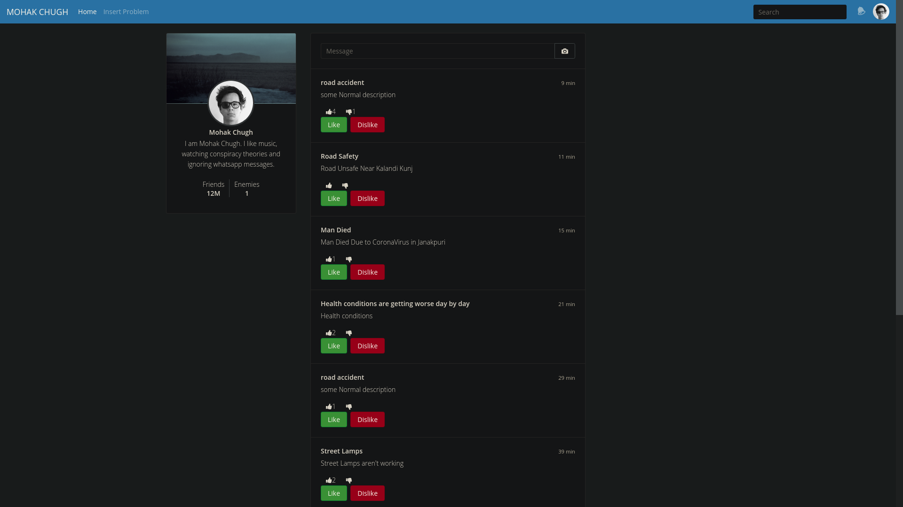

# Citizensapp

A city becomes smarter only when citizens and govt work together.
In a Smart City every citizen should be able to report the local problems effectively, anonymously (if required), via transparent process which reaches every remote area of the city.

## Business Relevance
Due to non-diverse nature of all the available applications for problem reporting to the government like HimatPlus - Women Empowerment, BSES - electricity, Swachh Bharat - cleanliness, there is a persistent need of a diverse problem reporting technological interface which connects the citizens to the govt. through transparent and open process.

Also due to the inconvenience to the people through these non-diverse apps, integration of social media platforms with our one-stop solution becomes a necessity for a smart city.

Solution:
A digitized platform that builds up on a community of people and government, integrated with social media platforms like facebook and twitter for solving grievances while mentating user interactivity, making process within reach of every single citizen of the city, via transparent & open process.

## Architecture Diagram


## Deployment Diagram


## Screenshots
Login: 


Feed:


### Frontend
The frontend is built on Angular 9

### Backend
The backend is built on NodeJS Express server

## Url for live demo:
https://citizensapp.firebaseapp.com

#### Credentials
```
Username: mohakchugh
Password: testtesttest
```